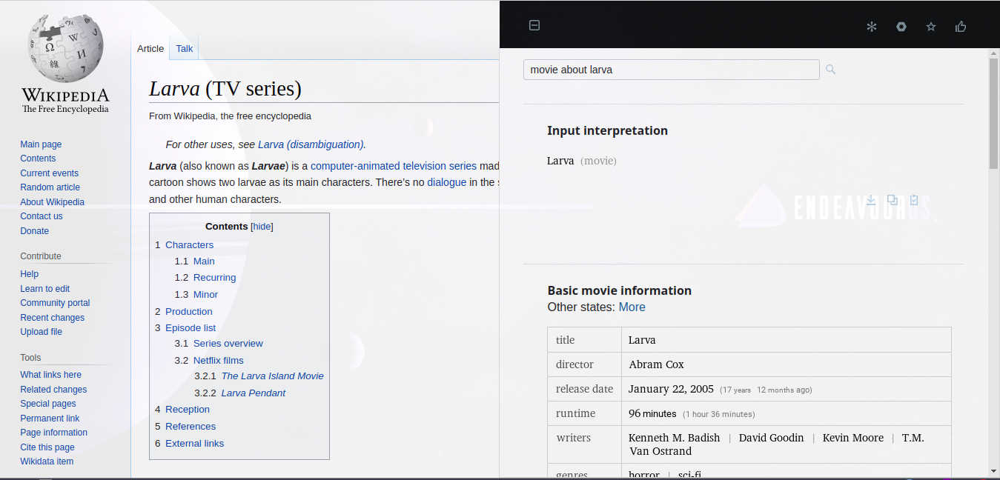
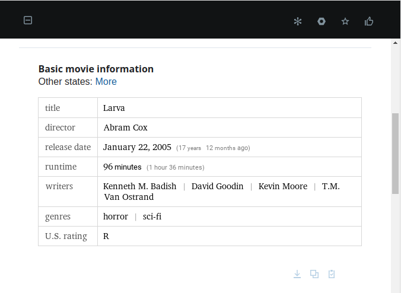
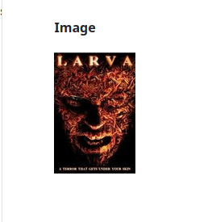
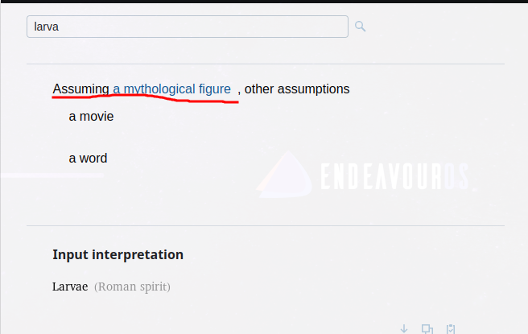
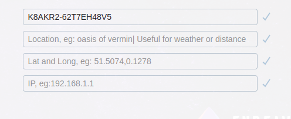

Descendant of Wolfram Panda

<video controls>
<source src="https://user-images.githubusercontent.com/69144096/211085462-81b60003-da61-4f71-a1d4-821f93afb858.mp4" 
type=video/mp4>
</video>

Rewrite Wolfram Pandas using React [Wolfram Pandas](https://github.com/nhannht/wolfram-panda), this is just a piece of
bigger system.

### Showcases
##### Curiosity about anything, just ask Wisdoom

##### Wisdoom is very knowledgeable, they will answer you even it is wrong answers

##### Change any assumption to get different answers

##### Flexible settings to enrich your experience

##### Quick answer when typing if available
